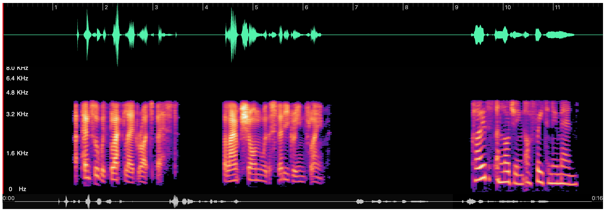

# wavesurfer

## Usage

``` bash
$ pip install wavesurfer
```

``` python
import torchaudio
from wavesurfer import wavesurfer

wav = "data/test_16k.wav"
waveform, sr = torchaudio.load(wav)
wavesurfer.display_audio(waveform, sr, enable_minimap=True, enable_spectrogram=True)
```


