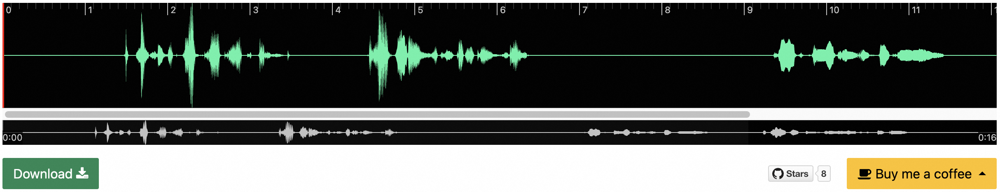
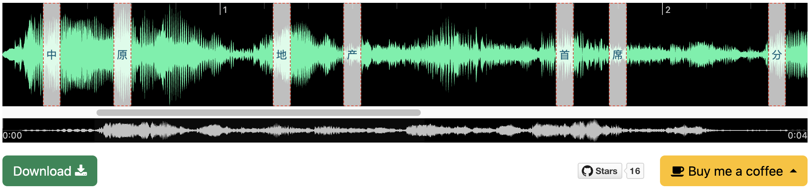

# wavesurfer

[](https://pypi.org/project/wavesurfer/)
[](LICENSE)

A Python package for audio visualization and playback in Jupyter notebooks.

## Features

- Visualize audio waveforms in Jupyter notebooks
- Support for various audio formats (WAV, MP3, FLAC, etc.)
- Streaming audio playback for real-time applications
- Bounded, throttled waveform previews for long-running streams
- Programmatic control with play/pause functionality
- Performance monitoring with latency and RTF metrics
- Display alignment information on waveforms

## Installation

```bash
pip install wavesurfer
```

## Usage

### Basic Playback

Play a wave file directly:

```python
from wavesurfer import play

play("assets/test_16k.wav")
```



Play waveform data:

```python
from audiolab import load_audio
from wavesurfer import play

audio, rate = load_audio("assets/test_16k.wav")
player = play(audio, sample_rate=rate)
```

### Displaying Alignments

Display alignment information on the waveform:

```python
from wavesurfer import play

# Play with alignment information from a TextGrid file
player = play(
    "assets/test_16k.wav",
    alignments="assets/test_16k.TextGrid",
    config={"options": {"normalize": True}},
)
```



You can also provide alignments as a list of alignment items:

```python
from wavesurfer import play

# Create alignment items
alignments = [
    {"start": 0.0, "end": 0.5, "content": "hello"},
    {"start": 0.5, "end": 1.0, "content": "world"},
]

# Play with alignment information
player = play("assets/test_16k.wav", alignments=alignments)
```

### Streaming Playback

Play streaming waveform data:

```python
import time
from audiolab import load_audio
from wavesurfer import play

def audio_generator():
    frame_size = int(0.3 * 16000)
    for frame, _ in load_audio("assets/test_16k.wav", frame_size=frame_size):
        time.sleep(0.1)  # RTF: 0.1 / 0.3 < 1
        yield frame

player = play(audio_generator(), sample_rate=16000)
```

Streams may also yield `(chunk, sample_rate)` pairs, which is useful when the
rate is discovered while producing the audio. A stream must keep the same
sample rate throughout.

Async generators can be observed, cancelled, and cleaned up explicitly:

```python
player = play(async_audio_generator(), sample_rate=16000)
await player.wait()

# Or stop ingestion early:
player.cancel()
player.close()
```

Streaming keeps only a bounded window for waveform previews. Full audio is
retained for download by default but generated as a WAV only when requested.
This behavior is configurable:

```python
player = play(
    audio_generator(),
    sample_rate=16000,
    config={
        "streaming": {
            "previewSeconds": 20,
            "waveformRefreshInterval": 1000,
            "retainAudio": False,
        }
    },
)
```

### Programmatic Control

For more advanced usage, you can use the `Player` class directly to have programmatic control over playback:

```python
from wavesurfer import Player

# Create a player instance
player = Player()

# Load audio
player.load("assets/test_16k.wav")

# Programmatically control playback
player.play()   # Start playback
player.pause()  # Pause playback
player.close()  # Release timers, audio contexts, URLs, and browser objects
```

The `Player` class also supports all the audio formats that the `play` function supports, including file paths, waveform data, and streaming generators.

`play()` returns the `Player`, so the shorter API can also be used with
programmatic controls. File inputs detect their sample rate automatically;
NumPy arrays require `sample_rate`.

`Player` is also a context manager when deterministic cleanup is convenient:

```python
with Player() as player:
    player.load("assets/test_16k.wav")
```

### Alignment Models

Dictionary alignments accept either `start`/`end`/`content` or
`start`/`duration`/`symbol`. You can also use the explicit `Region` model:

```python
from wavesurfer import Region, play

regions = [Region(start=0.0, end=0.5, content="hello")]
play("assets/test_16k.wav", alignments=regions)
```

Overlapping regions can be combined with `concatenate_overlaps=True`, or
matching labels can be merged with `merge_matching=True`.

For TextGrid files with multiple tiers, select one by name or index:

```python
play("audio.wav", alignments="alignment.TextGrid", alignment_tier="words")
```

## Development

Install the test dependencies and run the suite with:

```bash
pip install -e ".[test]"
pytest
node --test tests/js/*.test.js
```

WaveSurfer.js is vendored so a fresh clone works without a network download.
Maintainers can refresh the pinned browser assets with
`bash scripts/update_vendor_assets.sh`.

## License

[BSD 2-Clause License](LICENSE)
