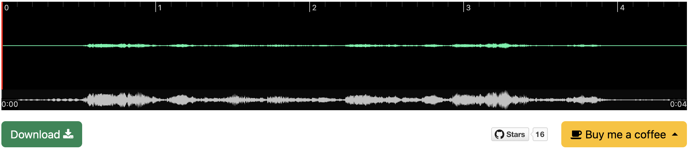

# wavesurfer

[](https://pypi.org/project/wavesurfer/)
[](LICENSE)

A Python package for audio visualization and playback in Jupyter notebooks.

## Features

- Visualize audio waveforms in Jupyter notebooks
- Support for various audio formats (WAV, MP3, FLAC, etc.)
- Streaming audio playback for real-time applications
- Programmatic control with play/pause functionality
- Performance monitoring with latency and RTF metrics
- Display alignment information on waveforms

## Installation

```bash
pip install wavesurfer
```

## Usage

### Basic Playback

Play a wave file directly:

```python
from wavesurfer import play

play("assets/test_16k.wav")
```



Play waveform data:

```python
from audiolab import load_audio
from wavesurfer import play

audio, rate = load_audio("assets/test_16k.wav")
play(audio, rate)
```

### Displaying Alignments

Display alignment information on the waveform:

```python
from wavesurfer import play

# Play with alignment information from a TextGrid file
play("assets/test_16k.wav", alignments="assets/test_16k.TextGrid", config={"options": {"normalize": True}})
```


You can also provide alignments as a list of alignment items:

```python
from wavesurfer import play

# Create alignment items
alignments = [
    {"start": 0.0, "end": 0.5, "content": "hello"},
    {"start": 0.5, "end": 1.0, "content": "world"},
]

# Play with alignment information
play("assets/test_16k.wav", alignments=alignments)
```

### Streaming Playback

Play streaming waveform data:

```python
import time
from audiolab import load_audio
from wavesurfer import play

def audio_generator():
    for frame, rate in load_audio("assets/test_16k.wav", frame_size_ms=300):
        time.sleep(0.1)  # RTF: 0.1 / 0.3 < 1
        yield frame

play(audio_generator(), 16000)
```

### Programmatic Control

For more advanced usage, you can use the `Player` class directly to have programmatic control over playback:

```python
from wavesurfer import Player

# Create a player instance
player = Player()

# Load audio
player.load("assets/test_16k.wav")

# Programmatically control playback
player.play()   # Start playback
player.pause()  # Pause playback
```

The `Player` class also supports all the audio formats that the `play` function supports, including file paths, waveform data, and streaming generators.

## License

[BSD 2-Clause License](LICENSE)
